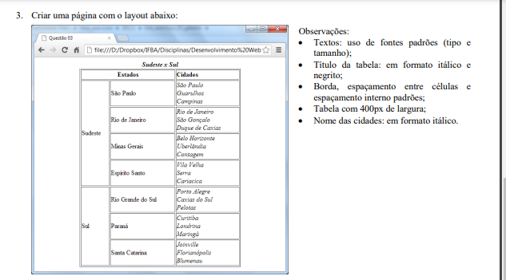

# Projeto Excercícios HTML
Projeto de resolução de 6 exercícios do Instituto Federal de Educação, Ciência e tecnologia da Bahia. 
## Índice
- Projeto / Exercícios
- Tecnologias ultilizadas
- Autor do projeto
 

## Projeto / Exercícios

### Exercício 1 Pedido: Criar uma tabela com as cidades mais populosas dos estados da Bahia, Pernambuco e São Paulo.

Exercício 1 Realizado!

### Exercício 2 Pedido: Criar uma pagina web com o seguinte layout. 

Exercício 2 Realizado!

### Exercício 3 Pedido: Criar uma pagina web com o seguinte layout, porém sem a barra de grade no campo cidades.

Exercício 3 Realizado!
### Exercício 4 Pedido: Criar uma pagina web com o seguinte layout, porém no campo cidade em lista não ordenadas.

Exercício 4 Realizado!

### Exercício 5 Pedido: Criar uma pagina web com o seguinte layout.
 

Exercício 5 Realizado!

### Exercício 6 Pedido: Criar uma pagina principal e 4 links que levam a 4 paginas com cardapio, dentro do cardapio contendo a receita do café. 

Exercício 6 Realizado!

## Tecnologias Ultilizadas
1. HTML 5
1. CSS 3
1. VISUAL STUDIO CODE
1. GIT E GITRUB

## Autor do projeto
Fábio Pereira
